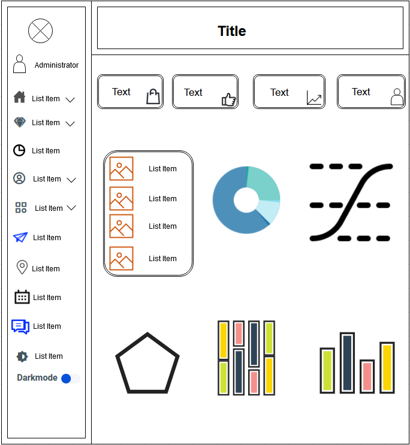
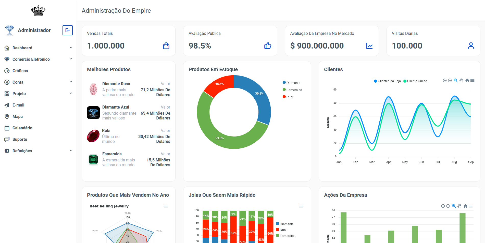
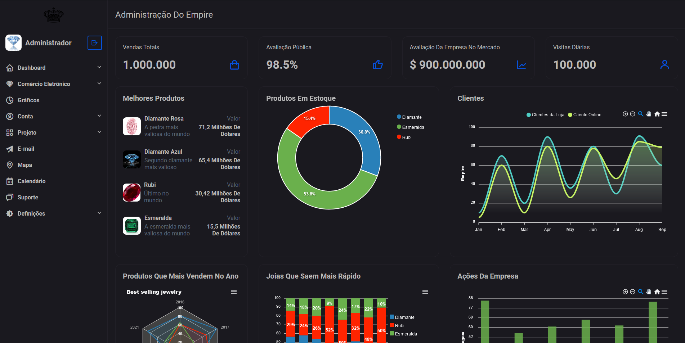

 

<h1>Dashboard  	:chart_with_upwards_trend:</h1>

Este projeto foi desenvolvido em HTML, CSS e JavaScript puro. Este projeto é uma continuação da página <a href="https://lucasgaldinno.github.io/empire-website/home.html">Empire</a>, nesse deshboard mostra o quanto a empresa vale no mercado, os produtos que mais temos em estoque. A avaliação das visitas diárias do público também mostra os produtos mais valiosos da loja, os produtos mais vendidos e mais vendidos no ano e os valores das ações da empresa.

<h2 align="center">
 Language
</h2>

<h2>Wireframe :pencil:</h2>

 
<h2 align="center">
Planejamento de projeto 📋  

</h2>
 
<h3 align="center">
Ferramenta utilizada para desenvolver o projeto :toolbox:
</h3>
Este projeto foi desenvolvido em Visual Studio Code 
June 2021 (version 1.58) <a href="https://code.visualstudio.com/">Visual Studio Code</a>
 
<h2 align="center">
Resultado final do projeto 🎯
</h2>
  

 

